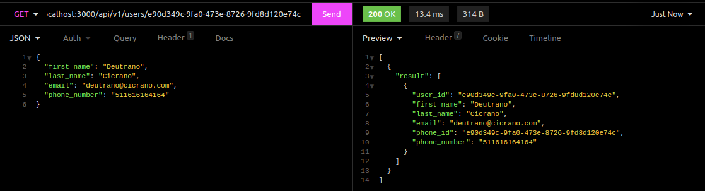
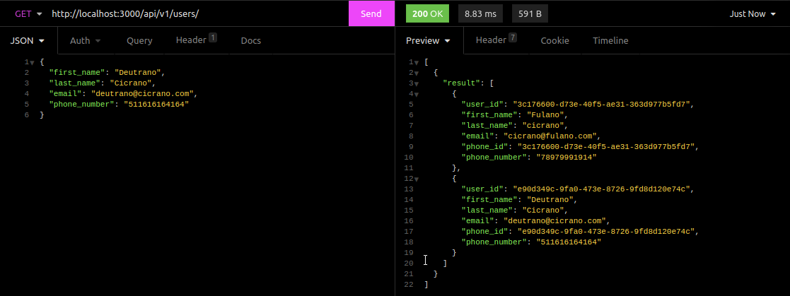
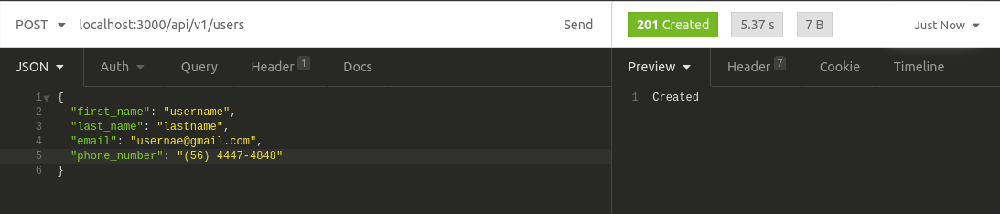
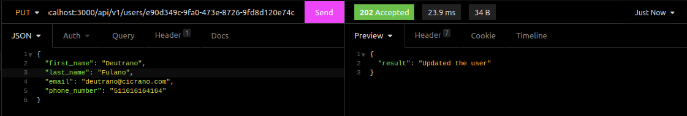
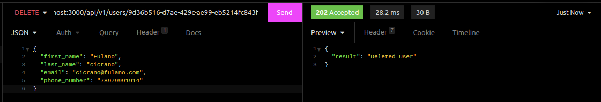
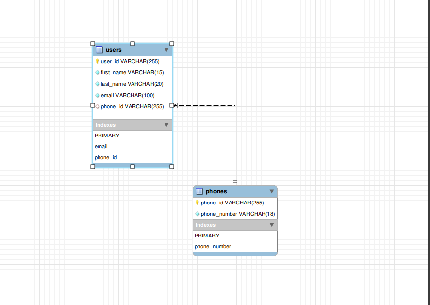

## API RESTFUL NodeJS with MySQL
## Conteúdo
Neste Projeto desenvolvi uma Api **RESTFUL** com NodeJS e MySQL, cada **endpoint** com seu respectivo método (GET / SELECT), (POST / INSERT), (PUT / UPDATE), (DELETE / DELETE)
## Pacotes usados
* `express`
* `mysql2`
* `uuid`

## Sistema de rotas
HTTP | ROUTE | BODY | DESCRIÇÃO |
| --- | ------ | ------ | ------ |
| GET | /api/v1/users/user_id? | | Rota para pegar todos os usuários ou enviar ID de usuário em especifico.
| POST | /api/v1/users | JSON (first_name (string), last_name (string), email (string) e phone_number(string ou number)) | Rota para criar usuários.
| PUT | /api/v1/users/user_id | JSON (first_name (string), last_name (string), email (string) e phone_number(string ou number)) | Rota para editar usuários (EX. nome, telefone)
| DELETE | /api/v1/users/user_id | parâmetro de rota (_id) | A rota irá excluir o usuário com ID informado

## Sistema de rotas
### Aqui estão alguns dos resultados do **Insomnia** retornados após o final do projeto.

## Rota GET que pega usuário por ID

## Rota GET que pega todos os usuários:

## Rota POST que cria usuários:

## Rota PUT que edita os usuários:

## Rota DELETE que deleta um usuário:

## Modelo do banco de dados em engenharia reversa:

## Dicionário

> **Endpoint:** Um endpoint nada mais é que as rotas da API, todas ! independentes de suas funções ou métodos as rotas são endpoint.

> **Restful:** Uma API restful é um conjunto de regras para criação de tal, fazendo ela ser mais legível entre os desenvolvedores, por exemplo: usar Status referentes a cada requisição, e methods de forma objetiva.
METHOD | ENDPOINT | STATUS | DEFINIÇÃO |
| --- | ------ | ------ | ------ |
| GET | `https://api/v1/users/22` | statusCode(404) | User not a found |
| POST| `https://api/v1/users `| statusCode(201) | User created |
