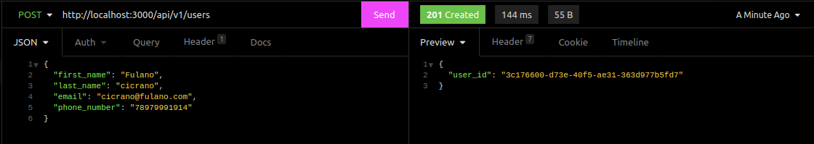
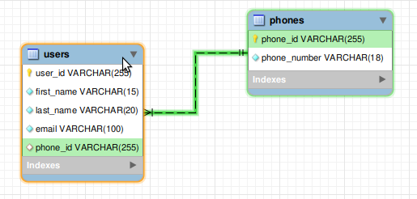

## API RESTFUL NodeJS with MySQL
 
## Conteúdo
 
Neste Projeto desenvolvi uma Api **RESTFUL** com NodeJS e MySQL, cada **endpoint** com seu respectivo método (GET / SELECT), (POST / INSERT), (PUT / UPDATE), (DELETE / DELETE)
 
## Pacotes usados
 
* `express`
* `mysql2`
* `uuid` ( minha idéia era usar o `AUTO_INCREMENT` do próprio MySQL, mas ele estava muito lento... então eu adotei a utilização `uuid` para criar os ID's)
 
## Quem pode entender este projeto ?
 
Bem, eu sempre tendo deixar o código o mais simples possível, mas tem vezes que não dá para simplificar e fica um tanto quanto complexo, segue o nìvel de conhecimento de cada tecnologia utilizada:
 
### NodeJs: **Intermediário - Avançado.**
### MySQL: **Intermediário - Avançado.**
### Uuid: **Básico.**

## Sistema de rotas
 
HTTP | ROUTE | BODY | DESCRIÇÃO |
| --- | ------ | ------ |  ------ |
| GET | /api/v1/users/ |  | Rota para pegar todos os usuários.
| GET | /api/v1/users/filterbyemail/:email | parâmetro de rota(email) | Rota para pegar o usuário com email informado.
| POST | /api/v1/users | JSON (Primeiro nome, sobrenome, email e número de telefone) | Rota para criar usuários.
| PUT | /api/v1/users/user_id | JSON (Primeiro nome, sobrenome, email e antigo número de telefone e novo número de telefone ) | Rota para editar usuários (EX. nome, telefone)
| DELETE | /api/v1/users/user_id | parâmetro de rota (_id) | A rota irá excluir o usuário com ID informado
 
 
## Performance da API:
 
### Aqui estão alguns dos resultados do **Insomnia** retornados após o final do projeto.
 
 
## Rota GET que pega todos os usuários:

 
## Rota GET que pega um usuário em específico:

 
## Rota POST que cria usuários:

 
## Rota PUT que edita os usuários:

 
## Rota DELETE que deleta um usuário:

 
 
## Modelo do banco de dados em engenharia reversa:
 

 
 
## Dicionário
 
> **Restful:** Uma API restful é um conjunto de regras para criação de tal, fazendo ela ser mais legível entre os desenvolvedores.
Exemplos:
 
* Use status referentes a cada requisição ou resposta
* Use methods a sua respectiva função
 
 
METHOD | ENDPOINT | STATUS | DEFINIÇÃO |
| --- | ------ | ------ |  ------ |
| GET | https://api/v1/users/22 | statusCode(404) | User not a found |
| POST| https://api/v1/users | statusCode(201) | User created |
 
> **Endpoint:** Um endpoint nada mais é que as rotas da API, todas ! independentes de suas funções ou métodos as rotas são endpoint. por exemplo:
 
GET `https://minhaapi.com/api/v1/users` Isso é um endpoint
 
DELETE `https://minhaapi/api/v1/users/4465454165156` isso tambem é um endpoint

